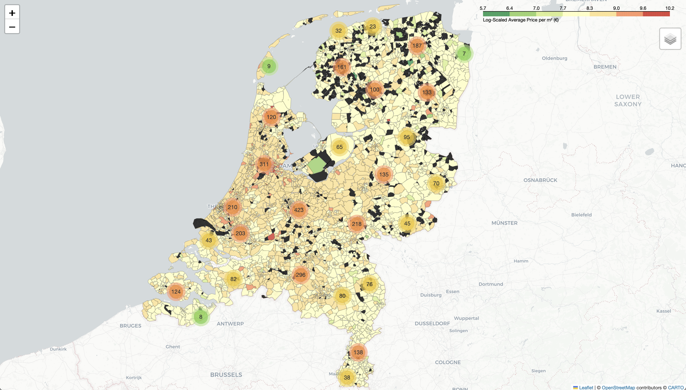

# 🏠 Dutch Housing Prices Visualizer

Visualizing average Dutch housing prices per m² with an interactive map.

---

## 🗺️ Map Preview
<p align="center">
  
</p>

---

## 🚀 Live Demo
➡️ **[Try it here](https://cozy-griffin-29a30e.netlify.app/map.html)**  

Explore the interactive map for detailed insights on property prices across the Netherlands.

---

## 📊 Data Overview
- 🏘️ **Over 70,000 houses and apartments** were scraped from [Funda.nl](https://www.funda.nl) to calculate the average price per m².
- 🌍 The GeoJSON file used to visualize zip code boundaries can be downloaded from [OpenDataSoft](https://public.opendatasoft.com/api/explore/v2.1/catalog/datasets/georef-netherlands-postcode-pc4/exports/geojson?lang=en&timezone=Europe%2FBerlin).
- 📍 Uses `Folium` for interactive mapping.
- 🗂️ Visualizes data on a per-zip-code basis.
- 🔍 Markers show detailed price data for improved clarity.

---

## 📋 How to Run Locally
1. Clone the repository:  
   ```bash
   git clone https://github.com/diego9621/Dutch-Housing-Prices
